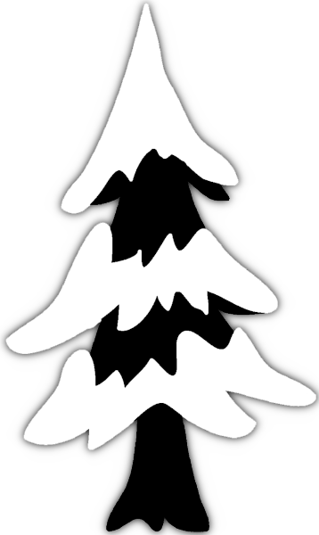

# PINS

Portraits d'indices de neige au sol / Bias-adjusted projections of snow cover over the Quebec Province using an ensemble of regional climate models.

This repository stores the code that generates the PINS datasets of daily snow water equivalent projections and the related indices.

## Context
In the context of climate change, stakeholders and decision-makers are in demand of easily accessible bias-adjusted projections of snow cover and their resulting indices to develop adaptation plans. To meet this need, we produced an ensemble of regional climate projections statistically bias adjusted of snow water equivalent (SWE) over the Quebec province. This bias adjustment required some fine-tuning to operational methods, mainly due to the seasonality in the SWE. We calculated SWE indices of interest for several sectors based on the bias-adjusted SWE. These indices include, but are not limited, the maximum of SWE, duration, start, and end of the snow season.

**Table 1. Members of PINS v1.0**

| **Institution** | **Model** | **Experiment** | **Driving model** | **Resolution** |
|-----------------|-----------|----------------|-------------------|----------------|
| UQAM            | CRCM5     | RCP4.5         | MPI-ESM-LR        | 0.44°          |
| OURANOS         | CRCM5     | RCP4.5         | CNRM-CM5          | 0.22°          |
| OURANOS         | CRCM5     | RCP4.5         | GFDL-ESM2M        | 0.22°          |
| OURANOS         | CRCM5     | RCP4.5         | MPI-ESM-LR        | 0.22°          |
| Iowa State Uni. | RegCM4    | RCP8.5         | HadGEM2-ES        | 0.22°          |
| UCAR            | RegCM4    | RCP8.4         | MPI-ESM-LR        | 0.22°          |
| NCAR            | WRF       | RCP8.5         | GFDL-ESM2M        | 0.22°          |
| OURANOS         | CRCM5     | RCP8.5         | CNRM-CM5          | 0.22°          |
| OURANOS         | CRCM5     | RCP8.5         | GFDL-ESM"M        | 0.22°          |
| OURANOS         | CRCM5     | RCP8.5         | MPI-ESM-LR        | 0.22°          |

